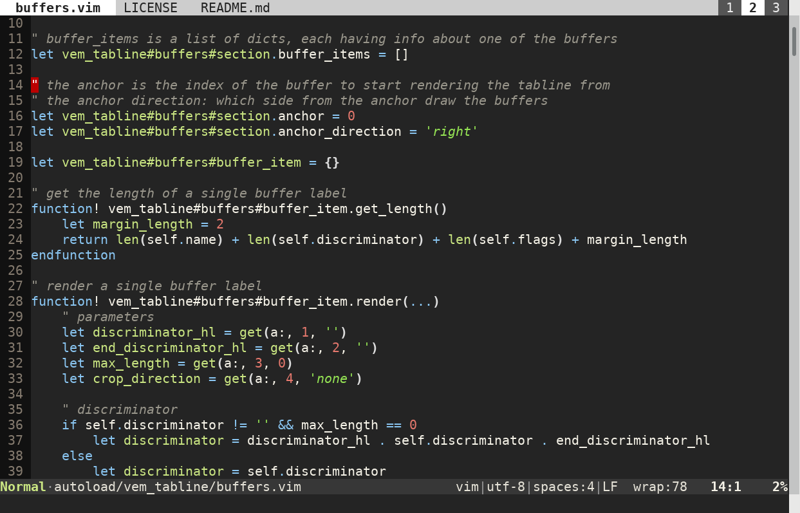

Vem Tabline
===========

Vem Tabline is a lightweight Vim plugin to display your tabs and buffers at the
top of your screen using Vim's tabline.



Vem tabline shows your tabs as numbered workspaces at the right of the top line
of the screen and the list of open buffers to the left.

By deafult:

* In tabs with only one window all buffers are listed.

* In tabs with more than one window, only the buffers that are being displayed
  are listed.

This allows you to have a cleaner list of buffers depending on the tab that is
active and goes well with Vim's philosophy of using tabs as workspaces to
arrange windows in different configurations. If you want to always see all
buffers independently of the number of windows set the
`g:vem_tabline_multiwindow_mode` to 0 as explained in
[Configuration](#configuration).

**Note**: Vem Tabline is one component of a larger Vim configuration project
named Vem, so the name is not a typo :) You can use Vem Tabline completely
independently from the parent project though. (Vem is still in the works but
will be released under the MIT license when all its parts are completed.)

Installation
------------

You can use Vem Tabline right away without additional configuration. Just
install the plugin and start using it. You only need to configure it if you
want to manually order the buffers in the tabline (explained below).

You need at least Vim 7 to use Vem Tabline.

Features
--------

There are many Vim plugins to display the list of buffers. I created Vem
Tabline because none of them had the features I needed:

* Use of Vim's native tabline (no horizontal splits).

* Support for displaying both buffers and tabs simultaneously.

* Support for Vim's native commands (no re-mappings necessary - there are
  key mappings offered by the plugin but they are optional).

* Possibility to reorder the buffers in the tabline.

* No fighting against Vim's native concepts (in particular no
  scoping buffers to certain tabs).

* Lightweight, performant and just focused on providing the tabline
  functionality.

The design of Vem Tabline is based on two very cool ones:
[vim-buftabline](https://github.com/ap/vim-buftabline) and
[WinTabs](https://github.com/zefei/vim-wintabs). It doesn't share code with
them but most ideas come from their original authors.

Moving Buffers in Tabline
-------------------------

Vem Tabline allows you to change the order in which buffers are shown in each
tab. To do so, use the following `<Plug>` mappings:

`<Plug>vem_tabline_move_buffer_left-`: Move selected buffer to the left
`<Plug>vem_tabline_move_buffer_right-`: Move selected buffer to the right

Vim doesn't support ordering buffers natively so if you use `:bnext` and
`:bprev`, they will not follow the order of buffers in the tabline if you have
modified it. To avoid this problem you can use the following mappings:

`<Plug>vem_tabline_prev_buffer-`: Select previous buffer in tabline
`<Plug>vem_tabline_next_buffer-`: Select next buffer in tabline

For example you could set your mappings like:
```
nmap <leader>h <Plug>vem_tabline_move_buffer_left-
nmap <leader>l <Plug>vem_tabline_move_buffer_right-
nmap <leader>p <Plug>vem_tabline_prev_buffer-
nmap <leader>n <Plug>vem_tabline_next_buffer-
```

You may also want to map the numbered keys to quickly access your tabs. To do
so, use the following key mappings:
```
nnoremap <leader>1 :1tabnext<CR>
nnoremap <leader>2 :2tabnext<CR>
nnoremap <leader>3 :3tabnext<CR>
nnoremap <leader>4 :4tabnext<CR>
nnoremap <leader>5 :5tabnext<CR>
nnoremap <leader>6 :6tabnext<CR>
nnoremap <leader>7 :7tabnext<CR>
nnoremap <leader>8 :8tabnext<CR>
nnoremap <leader>9 :9tabnext<CR>
```

Color Scheme
------------

Vem Tabline uses the default colors of your color scheme for rendering the
tabline. However you may change them using the following highlighting groups:

Highlighting Group    | Default     | Meaning
----------------------|-------------|------------------------------
VemTablineSelected    | TabLineSel  | Selected buffer
VemTablineNormal      | TabLine     | Non selected buffer
VemTablineShown       | TabLine     | Buffer displayed in window
VemTablineLocation    | TabLine     | Directory name (when present)
VemTablineSeparator   | TabLineFill | +X more text
VemTablineTabSelected | TabLineSel  | Selected tab
VemTablineTabNormal   | TabLineFill | Non selected tab

Configuration
-------------

The plugin is pretty simple and doesn't require manual configuration. However,
there are some parameters that you may want to change. The most important ones
are:

`g:vem_tabline_show`: boolean (default: 1)

    The value of this option specifies how the tabline will be shown:

    0: never shown
    1: shown when there's more than one tab or buffer open
    2: always shown

    Note: Vim option `showtabline` is used for the same purpose and takes these
    same values, however it only checks the number of tabs and ignores the
    number of buffers when it is set to 1. Please, use `g:vem_tabline_show`
    instead of `showtabline` since the plugin will override the value of the
    option to fix this behavior.

`g:vem_tabline_multiwindow_mode`: boolean (default: 1)

    When this mode is active, for layouts of multiple windows in the tabpage,
    only the buffers that are displayed in those windows are listed in the
    tabline. That only applies to multi-window layouts, if there is only one
    window in the tabpage, all buffers are listed.

    If this mode is set to 0, all buffers are listed in the tabline regardless
    of the window layout.

There are other minor configuration options available in the Vim [help
file](/doc/tabline.txt) provided with the plugin.

Note: If you don't have set it yet, probably you may want to specify:
```
set hidden
```
in your `vimrc` file in case you want to be able to switch buffers without
having to save their changes before.

